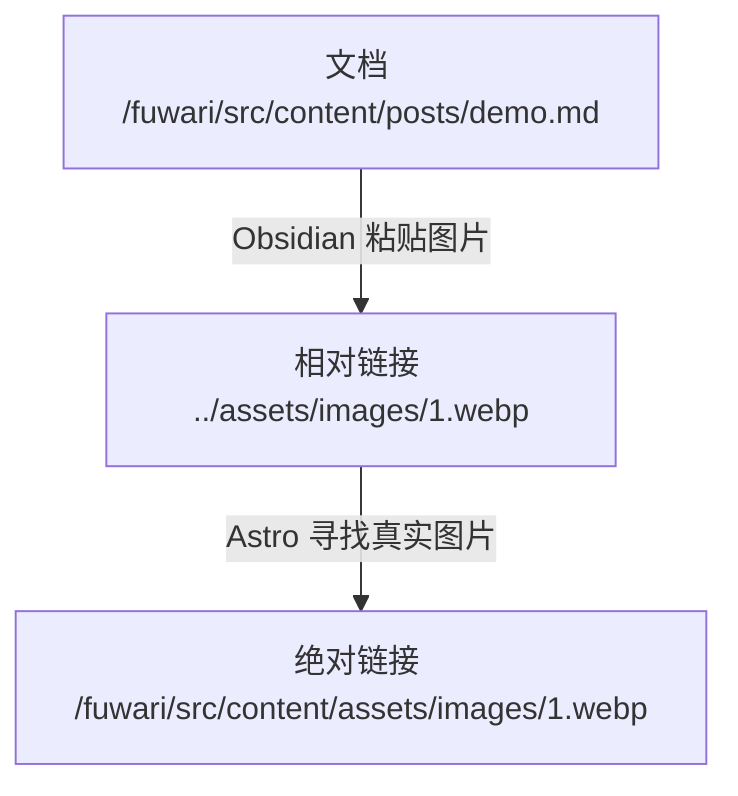
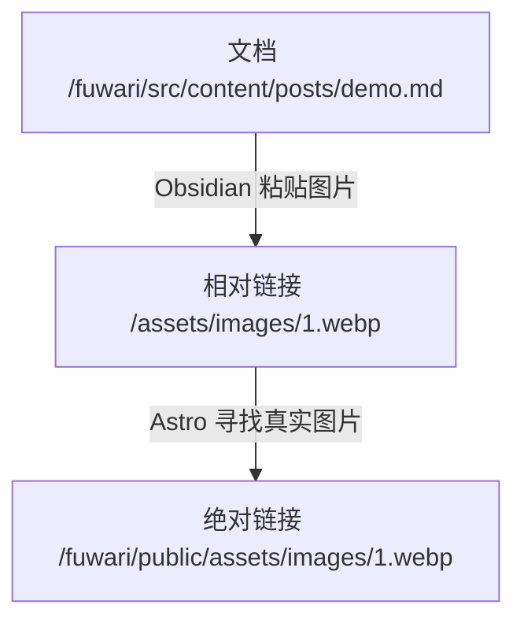

# 引言
众所周知，目前我们用的是基于一个本来非常优雅的静态博客生成器 [Astro](https://docs.astro.build/zh-cn/getting-started/) 和一个本来非常优雅的博客主题 [Fuwari](https://github.com/saicaca/fuwari) 来制作的该网站

在这长达2年的魔改中，我们加入了一些神秘的功能和页面，比如： 访问量统计，论坛等等

这无疑会导致项目变重，最近我们每一次冷启动开发服务器的时间都长达 **几分钟** 。这显然是不正常的，因为 Astro 本着 0JS，按需加载，按需水合。就算我们有几百万个页面，dev也不应该需要这么长的时间来启动。所以，是时候来看看astro dev都干了些什么了

# 正式开始
我们观察到运行 `pnpm dev` （与 `astro dev` 等价）时，Vite在准备就绪后，日志会卡在这里很久
```sql
16:40:06 [astro-icon] Loaded icons from public/icons, fa6-brands, fa6-regular, fa6-solid, material-symbols, material-symbols-light, mingcute, simple-icons
```

不难看出，这是Astro在收集并加载站点中的所有图标，并且在很长一段时间后，站点第一屏出现，时长为...
```sql
16:40:53 [200] / 37527ms
```

这显然不合理，就算图标再多，他也只是一个不超过10MB大小，不超过几百个的小文件而已。astro dev在默认情况下显然隐瞒了一些东西

那么我们就需要使用 `--verbose` 标志，来事无巨细的获取开发服务器究竟被什么东西卡了这么久

$图片

显然，我们会发现 Astro 在 Vite 准备就绪后就开始加载schema了，最典型的就是图片，由于图片在 `/src/content/assets` 下，Astro会将其当作内容集合去处理，而我们的项目总共有 **1000+** 图片，这会导致所有图片都会走一遍Astro的处理，哪怕我们在 `astro.config.mjs` 声明了 [no-op 透传](https://docs.astro.build/zh-cn/guides/images/#%E9%85%8D%E7%BD%AE-no-op-%E9%80%8F%E4%BC%A0%E6%9C%8D%E5%8A%A1)
```js
export default defineConfig({
    image: {
        service: passthroughImageService(),
    },
```

而我们最终上线的时候，图片会被替换为CDN源，尽管这个问题并不影响云端构建（因为 `src/content/assets` 目录下在构建前就会被清空）。但是它大大拖慢了本地启动开发服务器时的速度

实际上，我们只需要让 Vite 将图片映射正确即可，我们既不使用 Astro 图片压缩，也不使用响应式图片

那么，如何让 Astro 不再碰我们的图片呢？

我们可以将图片从 `src/content/assets` 目录移动到 `public/assets` ，由于Public文件夹内的所有内容会被原封不动复制到 `dist` ，Astro自然也不会对其操作，我们只需要确保图片路径映射正确即可

的确，这样修改后 Astro 不会再操作图片，但是对于之后的写作，我们也需要将图片放在 `public` 文件夹

所以我们需要修改一下我们写作使用的 **Obsidian** 的设置

首先，我们需要将工作目录从 `src/content` 切换到 `/` 。因为我们之前为了方便创建这种形式的图片链接： `../assets/images/1.webp` ，而 Astro 会自动根据当前文件所在的路径找到目标图片



由于我们现在的绝对链接为 `/fuwari/public/assets/images/1.webp` ，而 `public` 可以省略不写，则我们需要 Obsidian 写入类似这样的相对链接 `/assets/images/1.webp`



但是，经过实测，我们发现 Obsidian 对此的支持并不全，最终纯原版我们只能粘贴出 `public/assets/images/1.webp` 这样的ne