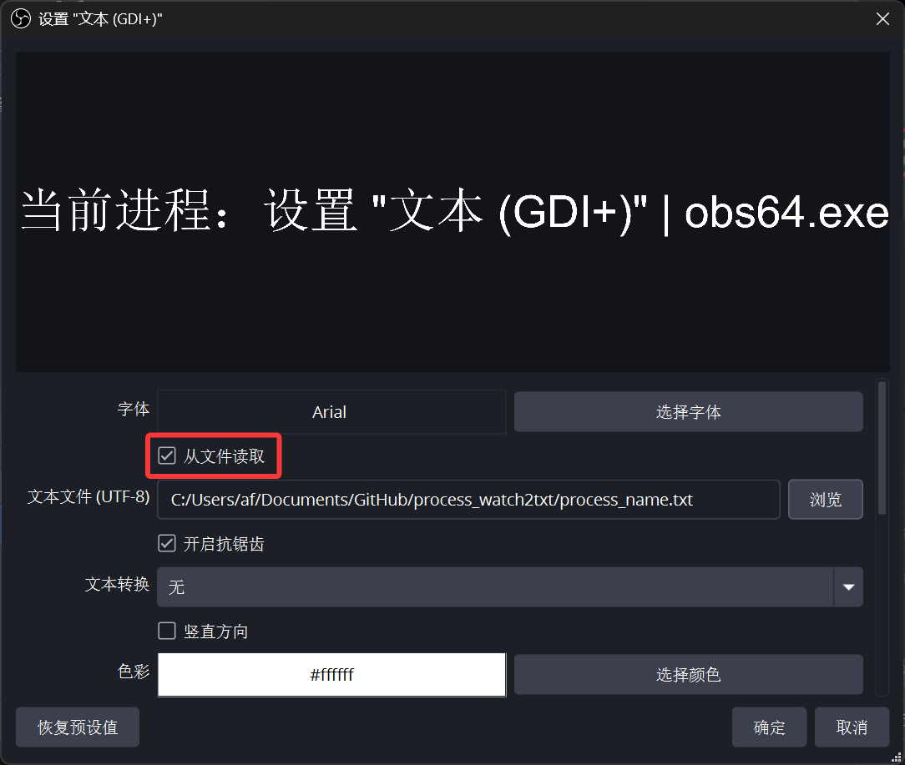
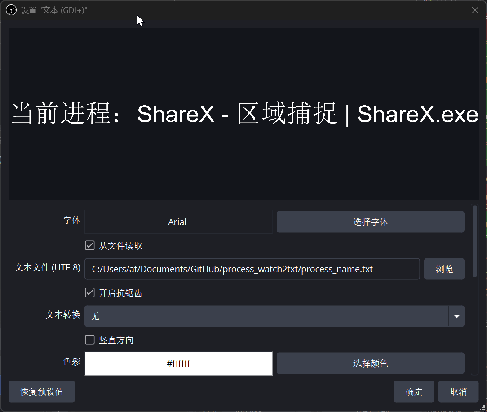
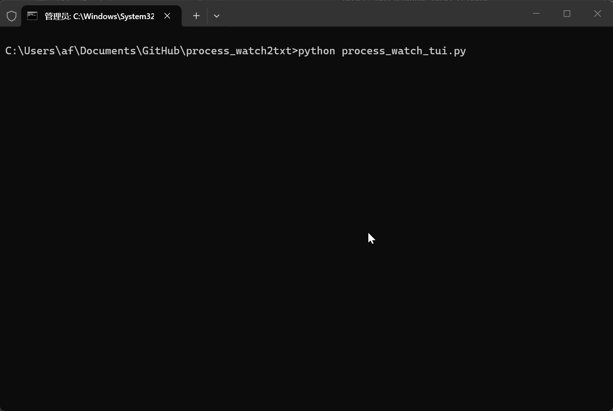
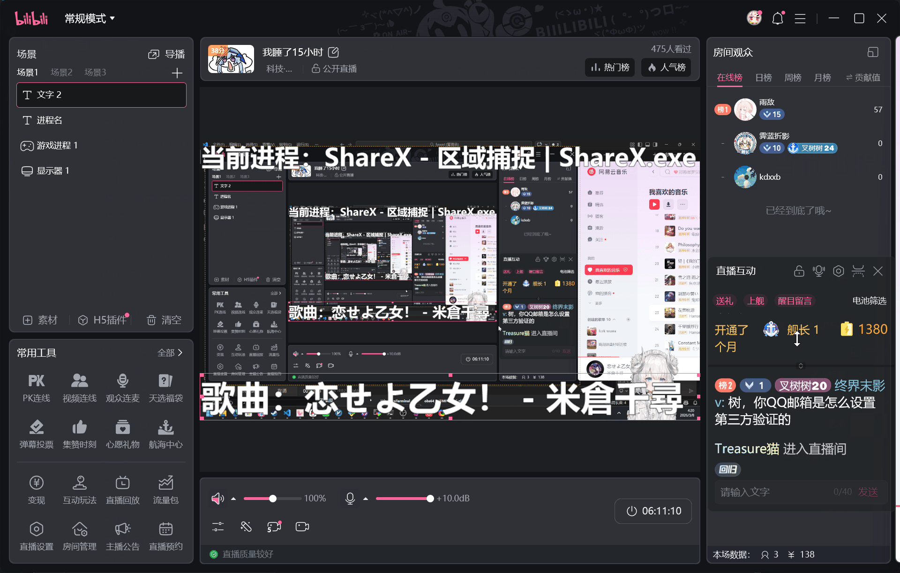

# 引言
我在直播的时候，经常有人问我

*主播主播，你这是什么软件？*

*主播主播，什么游戏？？*

*主播主播，这是什么歌？？？*

我们当然可以直接口头回应，但不够优雅，而且这些东西并不是什么隐私

我们完全可以写一个东西来自动化地将 **正在用什么软件** **正在听什么歌** 这类信息传递给观众

那么？我们具体要怎么做呢？

首先，我就想到了使用OBS的 **游戏源** ，因为我正在用 **VTube Studio** ，它其中就有一项功能支持将Live2D形象通过OBS的 **游戏源** 捕获并开启 **允许透明** 来得到一个干净的结果

而OBS的游戏源捕获，实际上捕获的是渲染管线，而非最终用户桌面的窗口，那么自然我们就需要编写一个走3D渲染的软件

但是吧，就实现这么一个简单的功能还要手搓DX或者OpenGL或者Vulkan程序还是太重了，有没有一个更好的方法呢？

最终，我发现，OBS有个源叫做 **文字** ，实际上，我们最终也只需要在推流中推几个文字出去，只不过需要进行实时更新

但是！文字源可以 **从文件读取** ，那么我们是否可以让OBS读这个文件，然后仅写一个软件改写这个TXT呢？

完全可以！实测OBS会隔几秒就更新一下TXT内的内容，虽然不是立即读取或者Hook，仅是简单的轮询，不过实现我们这个功能也并非需要多高的时效性

不过仅实现实时进程显示只是解决了： **我当前正在用什么软件** 

但如果说我们还想给观众实时展示正在放什么歌呢？

所以，我又加了一个功能，支持监测一个 **EXE** ，并且实时监测该EXE的标题名称变化，一般来说，大部分音乐软件都会把正在放的歌写到进程标题上

那么？如果期间我把音乐关掉了呢？

你只需要在不听歌的时候把进程完全退出（即在TXT中插入零宽空格）即可！再次启动会自动恢复显示！

我们只需要在OBS上添加两个文字源即可！

那么这个项目就诞生了！

[afoim/process_watch2txt: 将当前运行的进程名称和需要监视的目标进程名称写入TXT中，以便在OBS Studio中导入以给观众呈现当前您的电脑正在使用的软件](https://github.com/afoim/process_watch2txt)

